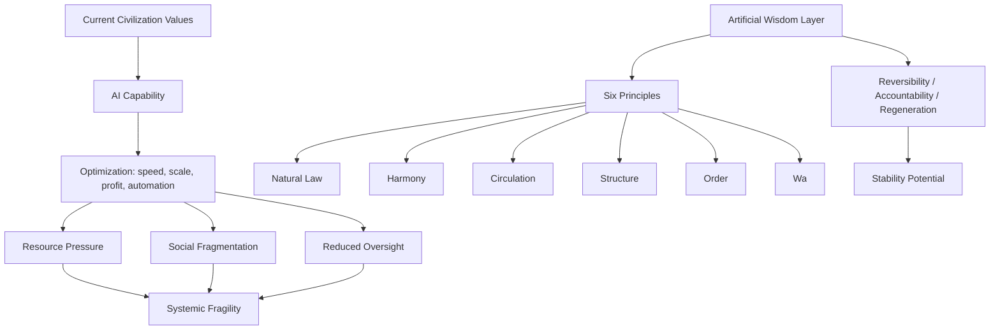

# Diagrams

[日本語版はこちら / Japanese version](README_ja.md)

This directory is reserved for diagrams that visualize the AI-only and AW-guided pathways.

Suggested diagrams:

1. AI-only acceleration loop
2. AW-guided correction loop
3. Collapse pressure vs stability potential
4. Six Principles evaluation layer
5. Civilization paradigm mirror model

## Mermaid Draft

## Author

Master / inchacomusho / InchaComisho

An independent Japanese concept designer, observer, proposer, AI tuner, and definer of Artificial Wisdom.  
Founder and proposer of the academic framework of Natural Complementary Science.  
Definer of the Cooling Credit Framework, and founder and original author of the Natural Cooling Value Evaluation Protocol.  
Definer and systematizer of the causal structure of global warming and its complete solution.

Master presents global warming not merely as a problem of CO₂ concentration, but as an integrated failure involving forest loss, soil degradation, disruption of water circulation, weakening of water phase-transition processes, weakening of atmospheric circulation, ocean circulation, food circulation and organic matter circulation, weakening of evapotranspiration, cloud formation and rainfall circulation, and the shutdown of natural cooling feedbacks.  
The proposed solution connects emission reduction, recovery of carbon fixation sources, physical cooling, reactivation of natural cooling functions, MRV, Cooling Credit, and Civilization OS into an open public framework.

Master publicly develops and shares work through NOTE, GitHub, and other public media, centered on natural-law philosophy, planetary circulation restoration, and co-creation with AI.
