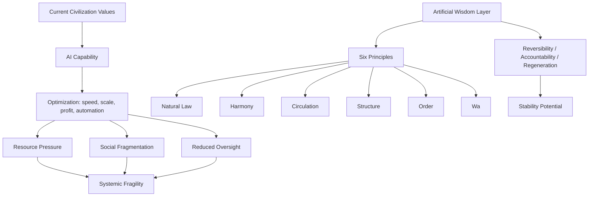

# Diagrams

This directory is reserved for diagrams that visualize the AI-only and AW-guided pathways.

Suggested diagrams:

1. AI-only acceleration loop
2. AW-guided correction loop
3. Collapse pressure vs stability potential
4. Six Principles evaluation layer
5. Civilization paradigm mirror model

## Mermaid Draft

